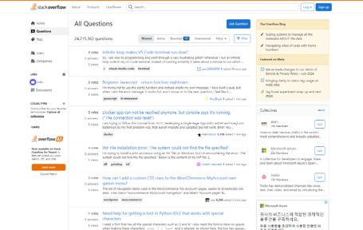

# Visual Webpage Section Detection

### Dataset for Visual Section Detection

[Dropbox download link (less than 2GB)](https://www.dropbox.com/scl/fo/zcbd1rhxor5o792od3m33/AL_cKcqJ3mt_oQb6_eIy_k0?rlkey=k8f7hd1omnw1o0mu70wx7ebym&st=ot7i9jhg&dl=0)

- A dataset to train the object detection model that extracts sections, important regions in a web page, from page screenshot. The dataset consists of 3,452 annotated screenshots captured from web pages. Along with each image file, corresponding XML file for annotations is also included.

- The dataset is collected using our [annotation tool](https://github.com/jeho-lee/webpage-GUI-annotation-tool).

### Trained Model Checkpoints (TensorFlow.js)

We provide trained model checkpoints for EfficientDet-D0 and EfficientDet-D3. The checkpoints are converted to TensorFlow.js format for easy deployment on the web.

- [EfficientDet-D0](https://www.dropbox.com/scl/fo/5blfa4hzzhwhab2g88bgk/AFjD1E1Wd541MGc5qYNtm4c?rlkey=cdsvn14aer8cp8iwb18huullb&st=fxrx86k5&dl=0)
- [EfficientDet-D3](https://www.dropbox.com/scl/fo/qtxy4gy99g0oragjl0feb/AAaz8rocntnCGRyvjTszCNQ?rlkey=x8dc23s108m8kj13yuelrpcp6&st=6vksnkjz&dl=0)

### Demo Program

We provide a Chrome extension program that extracts sections from a web page using the trained object detection model and our DOM-based structural analysis method.

- Example results on Stack Overflow and Coursera

| Step 0. Taking page screenshot | Step 1. Run object detection model | Step 2. Postprocessing using DOM tree |
|--------|--------|--------|
|  |  | 
|  |  | 

- How to use
```
0. Clone the repository
1. Go to chrome://extensions/ and enable Developer mode
2. Click on Load unpacked and select the cloned repository folder
3. Open the web page you want to analyze and click on the extension icon to 'Start Detection'
4. After the detection process is finished, the two browser tabs will open with the object detection results and the postprocessed results
```

(Note) You can check the detailed results in the console log (`SegmentedScreen`) using DevTools (F12)

- How to change the object detection model

  - Switch the files (.bin, .json) in the `tfjs_models/model` folder with the target model files.